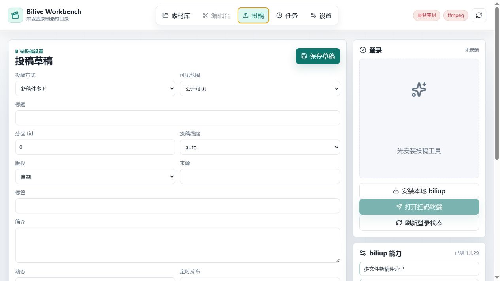
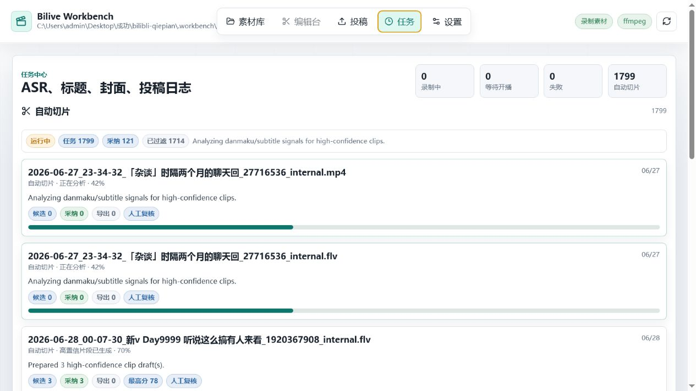

# Bilive Workbench

<div align="center">

**B 站直播自动录制、房间素材管理、AI 切片和投稿草稿工作台**


</div>

Bilive Workbench 是一个本地优先的 B 站直播工作台。它按直播间管理自动录制、弹幕 XML、素材入库、预览剪辑、字幕对齐、AI 高置信切片、封面抽帧、投稿草稿和 `biliup` 投稿前预检。

## 功能亮点

- **直播间自动录制**：每个直播间独立开关；开播后默认用 FLV 稳定录制，下播后收尾入库，可生成 MP4 预览或批量转换。
- **房间素材库**：按房间展示封面、视频数量、弹幕 XML 数量和最近视频；进入房间后只看该房间素材。
- **本地预览**：直接播放浏览器支持的 MP4/MOV；FLV/MKV 可生成本地 MP4 预览。
- **弹幕与字幕编辑**：解析 B 站 XML 弹幕，支持弹幕密度时间线、字幕行编辑和手动补字幕。
- **AI 自动切片**：结合弹幕密度、字幕和模型理由，生成少而准的高置信候选，自动导出并准备投稿草稿。
- **ASR 工作流**：支持 Fun-ASR-Nano、Qwen3-ASR-GGUF、本地命令和云端接口模式。
- **封面与标题**：可抽取切片封面帧，也可接入外部模型生成标题、理由和封面。
- **投稿准备**：管理分 P、读取历史稿件、生成/预检 `biliup` 命令，并保留真实投稿前确认入口。
- **任务中心**：集中查看录制、自动切片、ASR、转码、封面、标题和投稿任务日志。

## 功能截图

以下截图截取自 2026-07-02 的本地运行版本；完整逐项说明见 [docs/feature-tour.md](docs/feature-tour.md)。

### 素材库与房间管理


素材库按房间展示素材数量、弹幕数量、最近日期和录制状态。每张房间卡都可以直接执行立即录制、停止、移除录制和进入房间，适合把直播间当作长期素材池来管理。

### 房间工作台与 AI 切片


进入房间后可以在同一页完成视频预览、时间区间选择、当前区间 ASR、整片 ASR、AI 切片候选生成和切片草稿整理，减少在多个工具间来回切换。

### 弹幕与字幕面板


工作台下半区会把弹幕列表和字幕列表并排展示。弹幕可以直接按当前时间筛看，字幕支持补行和替换，适合在 AI 候选出来后继续做人工校正。

### 投稿草稿



投稿页上半区负责标题、可见范围、标签、简介、定时发布和登录状态。可以先把投稿元数据存成草稿，再回去继续补切片内容。

### 投稿预检与分 P


投稿页集中管理标题、封面、分 P 队列、Cookie、`biliup` 命令生成和预检结果；先把草稿整理完整，再决定是否执行真实投稿命令。

### 任务中心



任务中心会把自动切片、ASR、标题、封面、转码和投稿日志统一收口，适合排查长流程任务当前跑到了哪一步。

### 设置总览


设置页负责录制目录、ASR、视频理解、自动切片阈值、封面生成和投稿工具配置，适合首次部署和后续调参。

## 快速启动

第一次使用可以直接双击：

```text
setup.bat
start.bat
```

也可以使用命令行：

```powershell
npm install
npm run dev
```

启动后打开浏览器里的本地地址，先在 **设置** 页面确认录制输出目录、ffmpeg、ASR 和视频理解接口；再回到首页添加 B 站直播间并开启自动录制。

## 环境要求

| 依赖 | 用途 |
| --- | --- |
| Node.js | 运行 Vite 前端和 Express 本地服务 |
| ffmpeg / ffprobe | 抽帧、转码、切片导出、预览生成 |
| Python | 可选，用于本地 ASR、`biliup` 工作区安装 |
| biliup | 可选，用于投稿、追加分 P、读取稿件信息 |

## 常用命令

| 命令 | 说明 |
| --- | --- |
| `npm run dev` | 启动本地工作台 |
| `npm run build` | 构建前端产物 |
| `npm run typecheck` | TypeScript 类型检查 |
| `npm run test:workflow` | 运行 1-6 工作流本地回归汇总 |
| `npm run setup` | 安装基础依赖 |
| `npm run setup:qwen` | 安装依赖并准备默认 Qwen3-ASR 0.6B |
| `npm run start:workbench` | 使用 PowerShell 启动脚本运行工作台 |

## 验证命令

常规回归优先跑汇总命令：

```powershell
npm run test:workflow
```

单项排错命令：

```powershell
npm run typecheck
npm run test:server
npm run test:acceptance
npm run build
```

真实 B 站直播录制 smoke 需要选择一个当前开播的房间。开启 `REAL_BILI_REQUIRE_DANMAKU=1` 后，如果采样期间没有抓到真实 XML 弹幕 `<d>` 节点，脚本会直接失败：

```powershell
$env:REAL_BILI_ROOM_ID="545068"
$env:REAL_BILI_SAMPLE_SECONDS="45"
$env:REAL_BILI_REQUIRE_DANMAKU="1"
$env:VERIFY_REAL_LIVE="1"
npm run test:workflow
```

也可以只跑真实录制 smoke：

```powershell
$env:REAL_BILI_ROOM_ID="545068"
$env:REAL_BILI_SAMPLE_SECONDS="45"
$env:REAL_BILI_REQUIRE_DANMAKU="1"
npm run test:real-live-api
```

真实 UI 录制流程需要单独开启，避免在完整 acceptance 并发中重复操作同一个真实直播间：

```powershell
$env:REAL_BILI_ROOM_ID="545068"
$env:REAL_BILI_SAMPLE_SECONDS="15"
$env:REAL_BILI_REQUIRE_DANMAKU="1"
$env:REAL_BILI_UI="1"
npx playwright test tests/acceptance/real-live-verification.spec.ts
```

脚本会输出视频路径、XML 路径、写入速度、视频大小、`danmakuCount`、raw JSONL 行数和录制事件链。真实公开投稿不会被测试脚本自动执行；必须先通过投稿预检，并在有有效 cookie 时由用户明确确认。

完整 1-6 工作流验收证据见 [docs/verification-report.md](docs/verification-report.md)。

## 目录说明

```text
.
├─ src/                # React 前端界面
├─ server/             # Express API、本地媒体处理、ASR/投稿任务
├─ scripts/            # Windows 安装和启动脚本
├─ .workbench/         # 本地缓存、模型、草稿、导出文件，默认不上传
├─ dist/               # 构建产物，默认不上传
└─ README.md
```

`.workbench/` 会保存模型、cookie、任务草稿、导出视频、封面和临时素材。该目录已经写入 `.gitignore`，避免把本地隐私数据和大文件上传到 GitHub。

## 推荐工作流

1. 在首页添加 B 站直播间，开启该房间的 **自动录制**。
2. 主播开播后自动写入视频和弹幕；下播后素材自动出现在该直播间。
3. 点进直播间进入剪辑工作台，只处理当前直播间的视频、弹幕和字幕。
4. 使用 AI 切片生成少而准的候选，查看证据和模型给出的人话理由。
5. 按需运行 ASR、编辑字幕、生成标题和封面。
6. 在 **投稿** 页面管理分 P、预检命令，确认后再执行真实投稿。

## 注意事项

- 浏览器原生通常只能直接预览 MP4/MOV；直播录制建议用 FLV 保稳定，再生成 MP4 预览或批量转换。fMP4 可直接写 MP4，但直播流异常或未完整收尾时更容易无法预览。
- 真实投稿需要本地 `biliup`、有效 cookie 和明确的投稿确认开关。
- 外部模型接口默认按 OpenAI-compatible JSON 服务设计，也可以在设置页改成本地命令或自定义接口。
- 当前仓库未指定开源协议；公开使用或二次分发前请先补充许可证。
