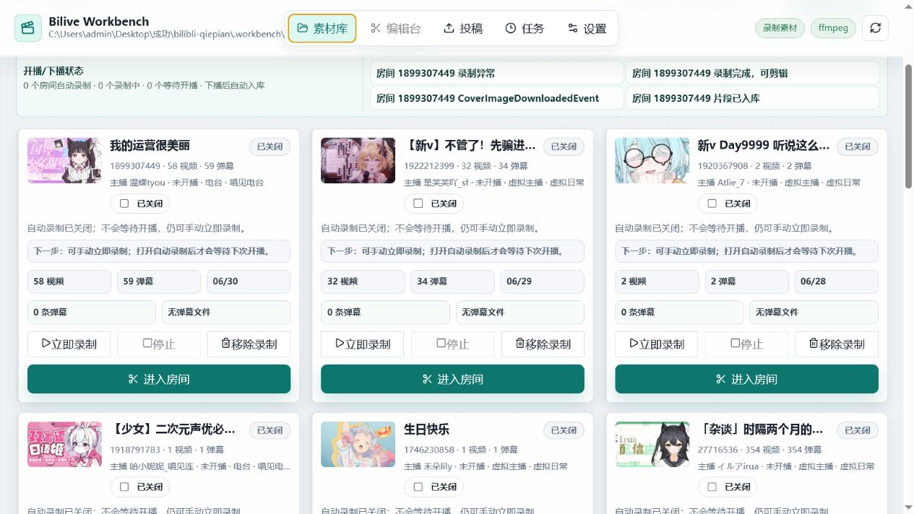
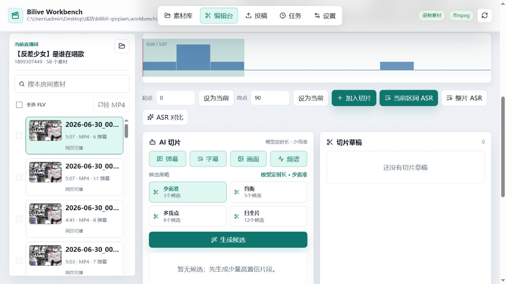
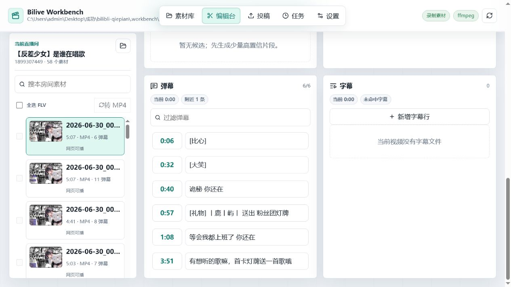
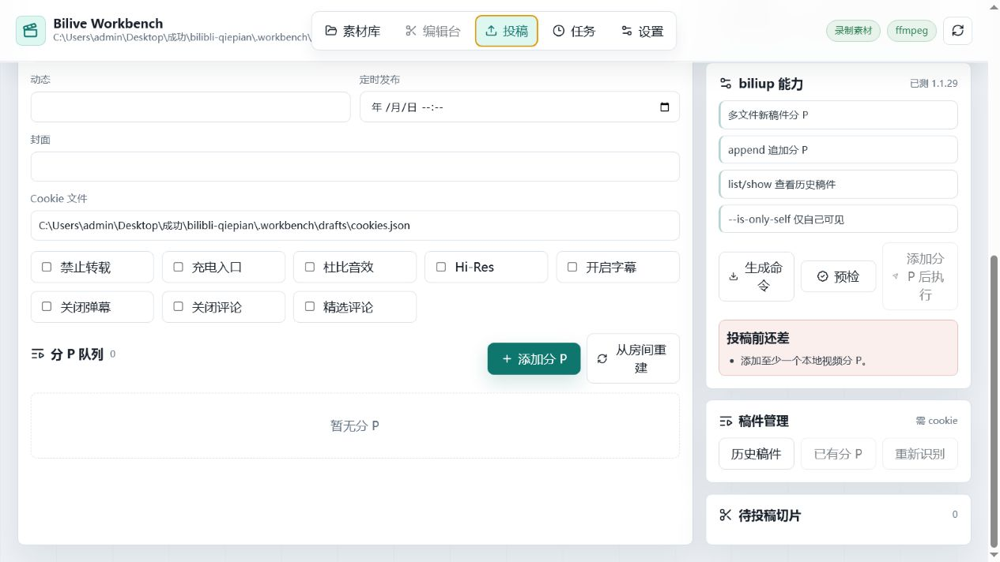
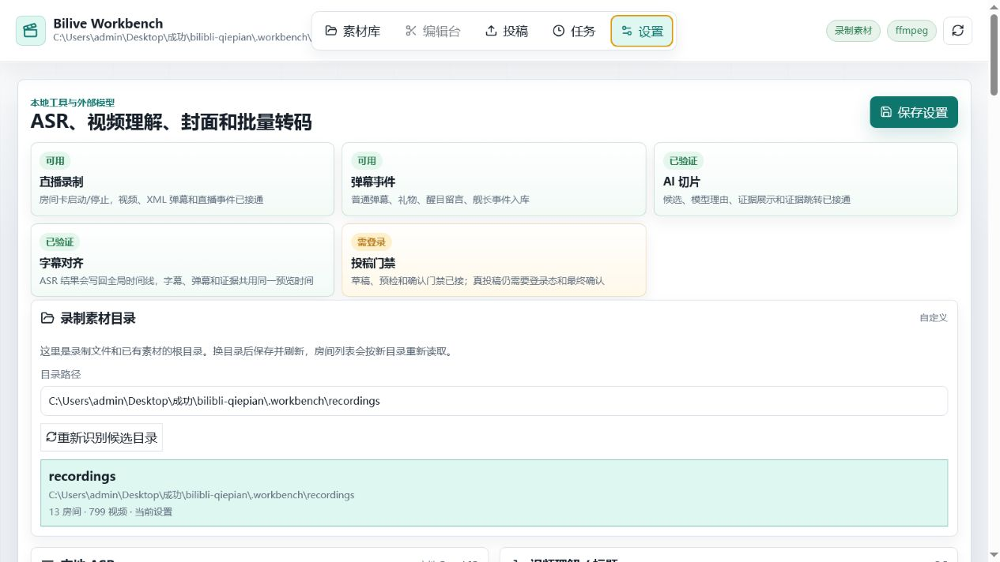

# Bilive Workbench

本地用的 B 站直播工作台。把录制、素材库、预览剪辑、字幕、AI 切片和投稿草稿放在同一个页面里做。

技术栈：React + Vite + Express。数据默认落在本机 `.workbench/`，不会跟着 git 走。



## 能干什么

- **按直播间录制**：加房间、开监控，开播录 FLV + 弹幕 XML，下播进素材库
- **房间素材库**：按房间看视频/弹幕数量，进房间只处理这个主播的东西
- **预览和切片**：MP4 直接播；FLV 可转封装或生成预览；时间线上能看弹幕密度
- **字幕**：读已有字幕，也能跑 ASR（Fun-ASR / Qwen3 / 自定义命令 / 云端）
- **AI 切片**：结合弹幕、字幕等信号出候选，带分数和理由；能接到自动导出/投稿草稿
- **投稿**：整理分 P、生成/预检 biliup 命令；真正上传前会再确认一次
- **任务中心**：录制、转码、ASR、自动化、投稿进度集中看

更细的界面说明在 [docs/feature-tour.md](docs/feature-tour.md)。

## 怎么跑

Windows 可以直接：

```text
setup.bat
start.bat
```

或者：

```powershell
npm install
npm run dev
```

浏览器打开 `http://127.0.0.1:5173`。

第一次建议先去 **设置**：

1. 填录制素材目录
2. 确认本机有 `ffmpeg` / `ffprobe`
3. 需要投稿再装 biliup、扫码出 Cookie
4. 需要 AI 切片/ASR 再填模型和接口

然后回素材库加直播间 ID，打开监控录制就行。

可选：顺带装默认 Qwen3-ASR：

```powershell
npm run setup:qwen
```

## 我一般怎么用

1. 加房间，打开自动录制  
2. 播完进房间，需要的话先转 MP4 / 跑一段 ASR  
3. 生成 AI 候选，不行的丢掉，好的导出  
4. 到投稿页补标题分 P，预检过了再点执行  

FLV 批量转换默认是 **stream copy**（快，不重编码）。要压体积再在设置里切压缩；有 NVIDIA 时压缩可以走 NVENC。

录制结束后如果开了「转封装 MP4」，会自动 remux 一份方便预览。

## 截图

| 工作台 | 弹幕 / 字幕 |
| --- | --- |
|  |  |

| 投稿 | 任务 / 设置 |
| --- | --- |
|  |  |

## 依赖

| 东西 | 要不要 | 干嘛的 |
| --- | --- | --- |
| Node.js 18+ | 要 | 跑前端和本地服务 |
| ffmpeg / ffprobe | 要 | 预览、切片、封面、转封装 |
| Python | 可选 | 本地 ASR、装工作区 biliup |
| biliup | 可选 | 投稿、追加分 P |
| 视觉/ASR 接口 | 可选 | AI 切片、转写 |

服务只绑 `127.0.0.1`，按本机工具来用的。

## 命令

```powershell
npm run dev            # 启动
npm run build          # 构建
npm run typecheck      # 类型检查
npm run test:server    # 服务端测试
npm run test:workflow  # 工作流回归
npm run setup          # 装依赖
npm run setup:qwen     # 依赖 + Qwen3-ASR
```

真直播抽一段测录制（自己换房间号）：

```powershell
$env:REAL_BILI_ROOM_ID="545068"
$env:REAL_BILI_SAMPLE_SECONDS="45"
$env:REAL_BILI_REQUIRE_DANMAKU="1"
npm run test:real-live-api
```

## 目录

```text
src/          前端
server/       录制、媒体、ASR、投稿 API
scripts/      安装和启动脚本
docs/         功能导览和截图
tests/        测试
.workbench/   本机缓存（gitignore）
```

## 注意

- Cookie、视频、模型都在本地；只有你主动配置的云端接口才会出网
- 真投稿需要 biliup + Cookie，并且页面上确认后才会跑
- 现在许可证是 UNLICENSED，公开分发或商用前自己补协议
- 代码里 `App.tsx` / `routes.mjs` 还很胖，后面打算拆；issue/PR 都欢迎

仓库：https://github.com/wwwufjjd/bilibli-qiepian
