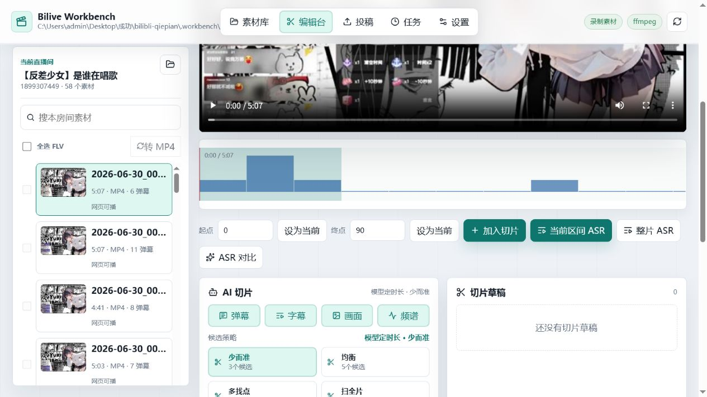
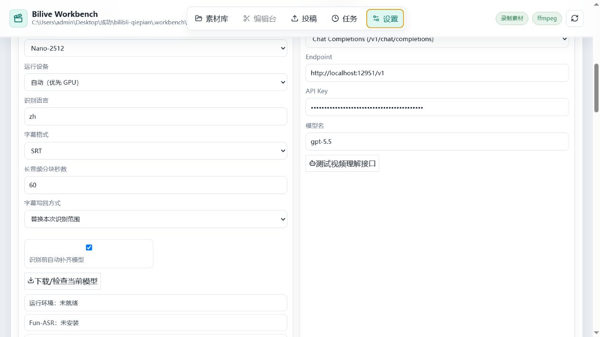
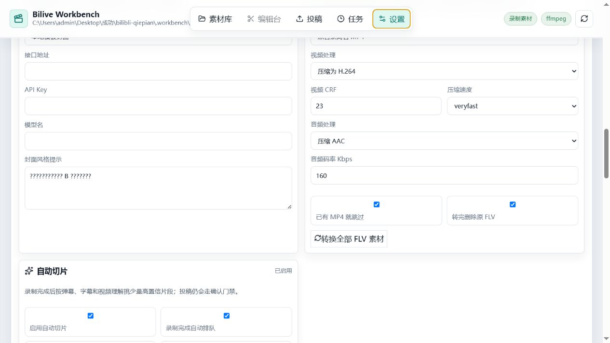
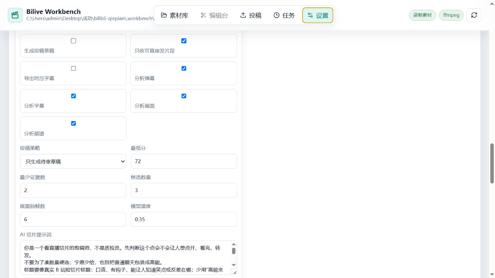

# Bilive Workbench 功能导览

以下截图截取自 2026-07-02 的本地运行版本，重点展示当前项目的主要工作流和页面结构。不同机器上的登录状态、模型安装状态和投稿工具状态可能会略有差异，但交互结构是一致的。

## 1. 素材库与房间卡片

- 素材库按直播间组织素材，不把录制文件堆成一个大目录。
- 每张房间卡会展示直播间标题、房间号、主播、分类、素材视频数、弹幕文件数和最近日期。
- 卡片级操作包括 `立即录制`、`停止`、`移除录制`、`进入房间`，适合一边看状态一边做操作。
- 上方的开播/下播状态和事件列表，会把自动录制、入库和异常信息集中展示出来。

## 2. 房间工作台：视频预览与时间区间

- 左侧是当前房间的素材列表，只处理这个房间的视频和弹幕。
- 中间主区域提供视频预览、时间线和区间起止点，适合先看内容、再决定切片范围。
- `当前区间 ASR` 和 `整片 ASR` 按钮直接挂在工作台上，不需要跳去别的页面启动转写。
- 这也是后续 AI 切片、字幕编辑、标题封面和导出草稿的主操作入口。

- 工作台下半区把弹幕和字幕拆成并排面板，方便对照时间点继续做人工微调。
- 没有字幕文件时会明确显示空态和补字幕入口，不会把问题藏在后台任务里。

## 3. AI 切片：候选生成与证据来源

- AI 切片支持按 `弹幕`、`字幕`、`画面`、`频谱` 组合证据来判断切点。
- 提供 `少而准`、`均衡`、`多挑点`、`扫全片` 等候选策略，方便按不同场景调整召回与精度。
- 生成候选后会进入切片草稿区，后续可以继续补标题、封面和投稿信息。
- 这种设计把“先选片、再整理草稿”的流程压在一个工作台里，比较适合高频剪切片。

## 4. 投稿草稿：标题、元数据与登录状态

- 投稿草稿页统一管理投稿方式、可见范围、标题、分区、版权、标签、简介和定时发布。
- 右侧会显示本地 `biliup`、Cookie 和扫码登录状态，方便确认当前机器能不能继续往下走。
- 标题和封面不一定要一次性填完；可以先保存草稿，再回房间工作台继续补内容。
- 适合把“切片完成”和“正式投稿”之间的准备工作独立出来，降低误操作。

## 5. 投稿预检：分 P 队列与执行前门禁

- 页面下半区集中管理分 P 队列、是否开启字幕/评论/杜比/Hi-Res 等投稿参数。
- `生成命令`、`预检`、`添加分 P 后执行` 会在真正投稿前先做工具链和参数检查。
- `投稿前还差` 区域明确提示当前阻塞项，避免脚本直接跑到一半才发现缺少条件。
- `待投稿切片` 和稿件管理区适合把多个切片合并成一个多分 P 稿件来处理。

## 6. 任务中心：自动切片、ASR、标题、封面与投稿日志

- 任务中心统一展示自动切片、ASR、标题、封面、转码和投稿相关日志。
- 每条任务会显示当前阶段、进度、候选数、采纳数、导出数和人工复核状态。
- 对于长流程任务，不必盯着工作台页面等结果，可以切到这里看批处理是否成功推进。
- 当自动切片数量多时，这个页面也是排查失败任务和回看历史结果的主要入口。

## 7. 设置总览：目录与关键能力状态

- 设置页顶部会先汇总录制、弹幕、字幕、AI 切片和投稿门禁的连通状态。
- `录制素材目录` 支持切换根目录、重新识别候选目录，并显示当前目录下统计到的房间数和视频数。
- 这部分适合第一次部署时做环境自检，也适合换盘符、迁移素材目录后重新接线。

## 8. ASR 与视频理解：模型、接口和识别策略

- ASR 支持本地模型、云端接口和自定义命令，能按项目现有环境选择识别路线。
- 视频理解区可配置兼容 OpenAI 的接口地址、API Key、模型名和测试入口，用于 AI 切片和标题生成。
- 这里同时控制字幕格式、语言、分块秒数和自动准备模型等参数，适合做准确率和成本之间的取舍。

## 9. 封面生成与媒体处理

- 封面生成支持独立接口配置，也支持没有图像模型时回退到本地模板封面。
- 媒体处理区可以控制视频压缩编码、CRF、音频码率，以及 FLV 转 MP4 的批量策略。
- 这部分直接影响封面产出方式、导出质量和磁盘占用，是量产切片时很常用的一组设置。

## 10. 自动切片策略与投稿联动

- 自动切片可以设置是否启用、触发时机、是否自动排队，以及只收高置信片段还是扩大候选范围。
- 可分别控制是否分析弹幕、字幕、画面、频谱，以及最低分、最少证据数、候选数量和模型温度。
- 这部分决定了“录完就先出草稿”还是“只做保守推荐”，是整个自动化流水线的关键参数面板。
